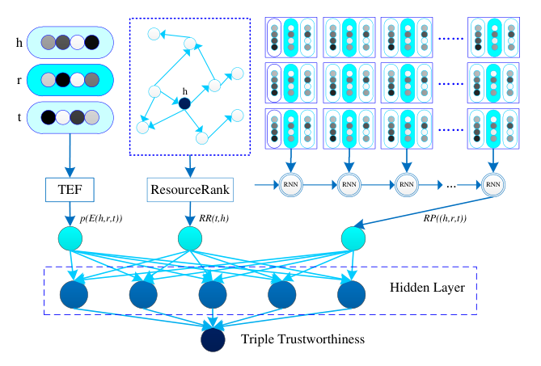

# Triple-Trustworthiness-mesurement-for-KG

目前是对KGTtm模型进行修改，后续想加入属性查看效果

#### 模型结构

Estimator1：收集实体层面的特征（实体节点重要性，入度出度）

Estimator2：E(h, r, t)=||h+r-t||

Estimator3：可达路径推理

#### 目前结果

目前准确率是68.4左右，但Estimator1的ResourceRank代码部分有问题还要改

